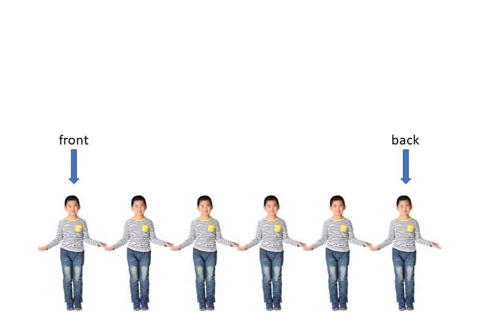
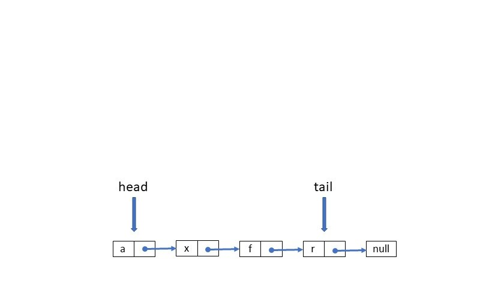
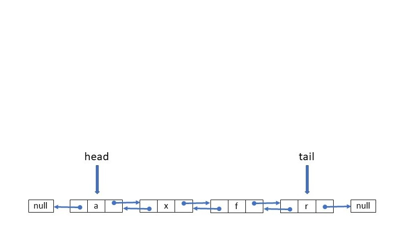
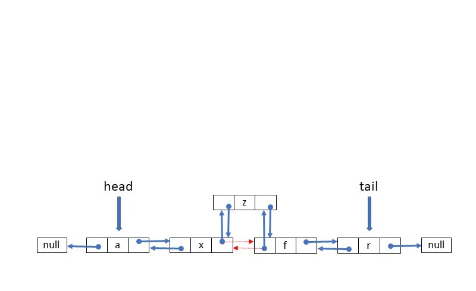
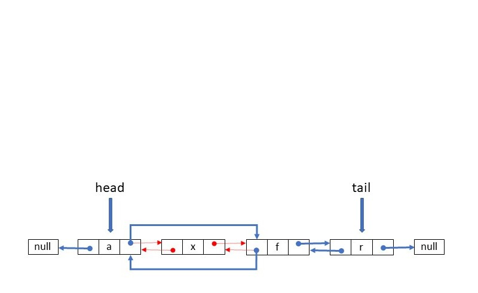

[Home](/final-project/welcome.md)

# Linked List

> "There are no morals about technology at all. Technology expands our ways of thinking about things, expands our ways of doing things. If we're bad people we use technology for bad purposes and if we're good people we use it for good purposes."
> ― Herbert Simon [^1]

Lets take a moment to imagine children lined up outside[^2], waiting to go to class after recess. Their teacher, worried that they will get lost on the way inside, asks each of the children to hold hands with the classmate in front of them and classmate behind them. The child at the front of the line will only hold hands with the child behind them. The child at the back of the line will only hold hands with the child in front of them. It would look something like this.



Now, the teacher will only have to keep track of the child at the front and the child at the back, because he knows that the rest are somewhere in the middle. This is similar to how linked lists work.

A linked list is a linear data structure that contains a sequence of nodes[^3]. A node contains data and a reference to the node next to it. Below is an example of a singly linked list (meaning each node only contains one reference).



A doubly linked list contains a reference to the node before and after it. This is what it would look like.



To insert a node into the middle of a linked list we just update the pointers (references) to the appropriate nodes. If we are inserting at the head or tail — then we just update the respective pointer.



Deleting a node from the middle is similar in fashion to inserting. We just update the pointers and the remove the reference from the node. If we are deleting the head or tail — then we just update the respective pointer.



## Usage

Linked lists are dynamic, or flexible in nature. They allow for easy insertion and deletion of nodes[^4] especially at the head and tail. Unlike static arrays, memory does not have to be reallocated if you go over a certain number of nodes. The greatest disadvantage is that it takes O(n) time to traverse a linked list. So operations that take place in the middle of the list can be expensive.

## Time Complexity[^5]

|     Operation      | Description                                        | Time Complexity |
| :----------------: | :------------------------------------------------- | :-------------: |
| insert_head(value) | Inserts value before the head.                     |      O(1)       |
| insert_tail(value) | Inserts value before the tail.                     |      O(1)       |
|  insert(i, value)  | Inserts value at position i                        |      O(n)       |
|   remove_head()    | Removes the head                                   |      O(1)       |
|   remove_tail()    | Removes the tail                                   |      O(1)       |
|     remove(i)      | Removes node i                                     |      O(n)       |
|       size()       | Returns the size of the linked list.               |      O(1)       |
|      empty()       | Returns true if the length of the linked list is 0 |      O(1)       |

## Example

Here is an example implementation of a linked list.

```python
class LinkedList:
    def __init__(self) -> None:
        """Initializes a new linked list."""
        self.head = None
        self.tail = None
        self.__size = 0

    @property
    def size(self):
        """A getter for returning the size of the linked list."""
        return self.__size

    @property
    def empty(self):
        """A property that checks if the linked list is empty."""
        if self.__size > 0:
            return False
        return True

    class Node:
        def __init__(self, data) -> None:
            """Initializes a new node."""
            self.data = data
            self.next = None
            self.prev = None

    def insert_head(self, value):
        """Inserts a node before the head."""
        # Create a new node
        node = LinkedList.Node(value)

        # If list is empty then assign head and tail to node.
        if self.head is None:
            self.head = node
            self.tail = node
        else:
            # Update the pointers.
            node.next = self.head
            self.head.prev = node
            self.head = node

        # Increment the size.
        self.__size += 1

    def insert_tail(self, value):
        """Insert a value after the tail."""
        # Create a new node.
        node = LinkedList.Node(value)

        # If the list is empty
        # then assign head and tail to node.
        if self.tail is None:
            self.head = node
            self.tail = node
        else:
            # Update the pointers.
            node.prev = self.tail
            self.tail.next = node
            self.tail = node

        # Increment the size.
        self.__size += 1

    def remove_head(self):
        """Deletes the first node."""
        # If the list is empty or has 1 item
        # then set the head and tail to None.
        if self.head == self.tail:
            self.head = None
            self.tail = None
        else:
            # Update the pointers.
            self.head = self.head.next
            self.head.prev = None

        # Decrement the size.
        if self.__size > 0:
            self.__size -= 1

    def remove_tail(self):
        """Removes the last node."""
        # If the list is empty or has 1 item
        # then set the head and tail to None.
        if self.head == self.tail:
            self.head = None
            self.tail = None
        else:
            # Update the pointers.
            self.tail = self.tail.prev
            self.tail.next = None

        # Decrement the size.
        if self.__size > 0:
            self.__size -= 1

    def insert(self, value, index):
        """
        Inserts node at specified index.
        Index is 0 based.
        """

        # Raise exception if index out of range.
        if index < 0 or index > self.__size-1:
            raise IndexError(f"{index} is out of range.")

        # If index is 0 then insert at head
        if index == 0:
            self.insert_head(value)
            return

        # Create a new node
        node = LinkedList.Node(value)

        # Traverse to node before index.
        curr = self.head
        while index > 1:
            curr = curr.next
            index -= 1

        # Update the pointers.
        node.prev = curr
        node.next = curr.next
        curr.next = node
        curr.next.prev = node

        # Increment the size.
        self.__size += 1

    def delete(self, index):
        """
        Deletes node at specified index.
        Index is 0 based.
        """
        # Raise exception if index out of range.
        if index < 0 or index > self.__size:
            raise IndexError(f"{index} is out of range.")

        # If index is 0 then delete head.
        if index == 0:
            self.remove_head()
            return
        # If index is equal to size then delete tail.
        elif index == self.__size-1:
            self.remove_tail()
            return

        # Traverse to node to be deleted.
        curr = self.head
        while index > 0:
            curr = curr.next
            index -= 1

        # Update the pointers.
        curr.prev.next = curr.next
        curr.next.prev = curr.prev

        # Decrement the size.
        if self.__size > 0:
            self.__size -= 1

    def __iter__(self):
        """Iterate foward through the Linked List."""
        curr = self.head
        while curr is not None:
            yield curr.data
            curr = curr.next

    def __str__(self):
        """Return a string representation of the linked list."""
        output = "linkedlist["
        first = True
        for value in self:
            if first:
                first = False
            else:
                output += ", "
            output += str(value)
        output += "]"
        return output

```

## Practice Problem

We will use a linked list to implement a CD player.
Use what you know about linked lists to solve the two
problems below.

You can find the solution [here](solution.py).

```python
from linkedList import LinkedList

"""
Controls on a CD Player include Stop, Play, Skip, Back
"""
class CD:
	def __init__(self) -> None:
		"""Initializes an instance of CD."""
		self.tracks = LinkedList()
	##########################
    #       PROBLEM 1        #
	##########################
	def add_song(self, title):
		"""Adds a song to the CD."""
        # Add code here to complete the function.

	##########################
    #    END OF PROBLEM 1    #
	##########################

class CD_Player:
	def __init__(self, cd:CD) -> None:
		"""Creates an instance of CD Player."""
		self.first = cd.tracks.head
		self.last = cd.tracks.tail
		self.curr = cd.tracks.head

	def play(self):
		"""Plays current track."""
		print(f"Play: '{self.curr}'")

	def stop(self):
		"""Stops current track."""
		print(f"Stop: '{self.curr}'")

	def skip(self):
		"""Skips to next track."""

		# If we reach end of tracks
		# then set the current track to the first.
		if self.curr.next is None:
			self.curr = self.first
		else:
			self.curr = self.curr.next

		# Play current track.
		print()
		print("Skip to next track.")
		self.play()

	def back(self):
		"""Skips to the previous track."""

	##########################
    #       PROBLEM 2        #
	##########################

        # Add code here to complete the function.

	##########################
    #    END OF PROBLEM 2    #
	##########################

		# Play current track.
		print()
		print("Skip to previous track.")
		self.play()

# Create an instance of CD.
cd = CD()

# Add songs to CD.
cd.add_song("Blinding Lights")
cd.add_song("The Twist")
cd.add_song("Smooth")
cd.add_song("Mack The Knife")
cd.add_song("Uptown Funk")
cd.add_song("How Do I Live")
cd.add_song("Party Rock Anthem")
cd.add_song("I Gotta Feeling")
cd.add_song("Macarena")
cd.add_song("The Shape of You")

# Create an instance of CD Player.
player = CD_Player(cd)

# Play first track.
player.play() # Output: Play 'Blinding Lights'

# Skip forward 3 tracks.
player.skip() # Output: Skip to next track.
			  # 		Play: 'The Twist'
player.skip() # Output: Skip to next track.
			  # 		Play: 'Smooth'
player.skip() # Output: Skip to next track.
			  # 		Play: 'Mack The Knife'

# Skip back 4 tracks.
player.back() # Output: Skip to previous track.
			  # 		Play: 'Smooth'
player.back() # Output: Skip to previous track.
			  # 		Play: 'The Twist'
player.back() # Output: Skip to previous track.
			  # 		Play: 'Blinding Lights'
player.back() # Output: Skip to previous track.
			  # 		Play: 'The Shape of You'


```

### Footnotes

[^1]: Quote by Herbert A. Simon. One of the creators of linked lists, [Brainy Quote](https://www.brainyquote.com/quotes/herbert_a_simon_193212)
[^2]: How do you explain linked lists in layman's terms?, [Quora](https://qr.ae/pvPxqO)
[^3]: Linked List, [Wikipedia](https://en.wikipedia.org/wiki/Linked_list)
[^4]: Under what circumstances are linked lists useful?, [Stack OverFlow](https://stackoverflow.com/a/2429320)
[^5]: Linked List in Python, [BYU-I CSE 212 Course Notes](https://byui-cse.github.io/cse212-course/lesson07/07-prepare.html#1.5)
