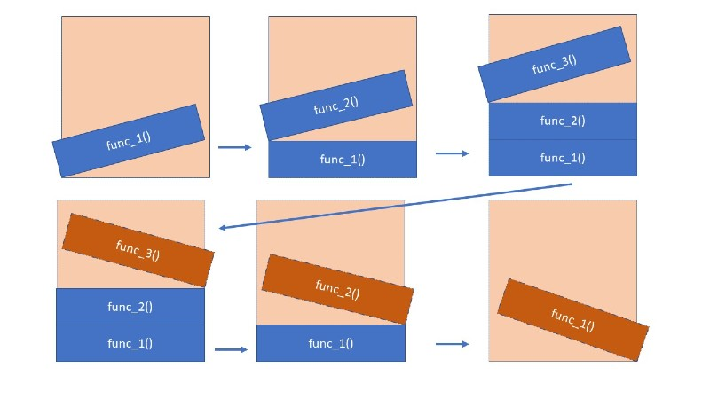
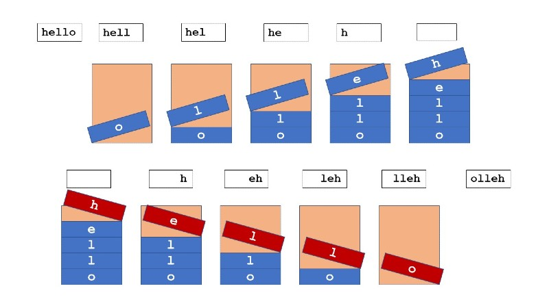
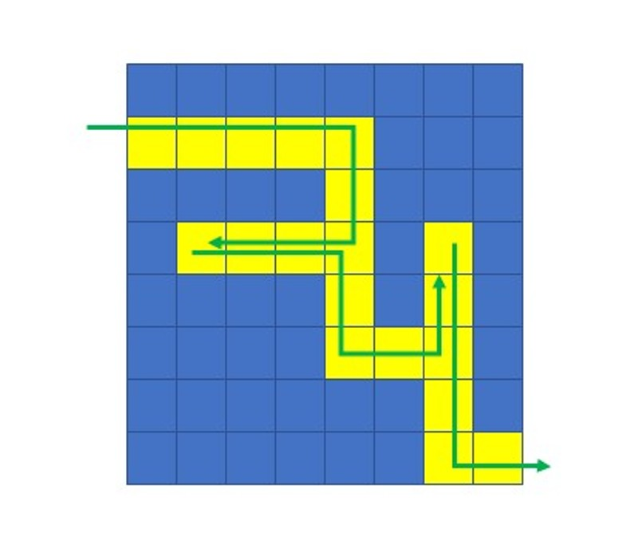

# Stack

> Software engineering is the establishment and use of sound engineering principles in order to obtain economically software that is reliable and works efficiently on real machines.
> ― Friedrich L. Bauer

A stack can be thought of as a stack of plates.

You can only add or remove plates from the top of the stack.
[^1]

In this example, each plate could be thought of as a function call. When a function is invoked, it is placed on the "call stack". When the function finishes execution, then it is removed from the call stack.



## Usage

A stack follows the principle of Last In First Out[^2]. This means that the most recent data (last in) is the first to be processed (first out). This makes it useful for several different processes[^3].

- Call Stack (which we covered in the previous example)
- Reversing

  In this example we use the stack as place to temporarily store each letter of the string.

  

- Undo/Redoing

  If you have ever used the undo button in a program, then you have probably used a stack.

- Backtracking

  A stack is used to keep track of where we have been in a program, which makes it useful for backtracking similar to solving a maze.

  

## Time Complexity

Operations in stacks are very efficient because we are only adding and removing from the top of the stack.

| Operation | Description                        | Time Complexity |
| :-------: | :--------------------------------- | :-------------: |
|   pop()   | Removes element from top of stack. |      O(1)       |
|  push()   | Adds element to top of stack.      |      O(1)       |
|  size()   | Returns the size of the stack.     |      O(1)       |
|  empty()  | Checks if the stack is empty.      |      O(1)       |

## Example

Here is an implementation of a stack.

```python
"""
We will create a stack by inheriting from python's built in list.
In addition we will add methods to push and pop.
And we will use the @property decorator to create a getter for empty.
"""
class Stack(list):
    def __init__(self):
        # Call the super class constructor.
        super().__init__()
        self._size = 0

    def push(self, value):
        """Adds value to end of the stack."""
        # Call the super class method append.
        super().append(value)

        # Increment the size of the stack.
        self._size += 1

    def pop(self):
        """Removes and returns last value of stack."""
        if not self.empty:
            # Decrement the size of the stack.
            self._size -= 1

            # Return the return value of the super class method pop.
            return super().pop()

    @property
    def empty(self):
        """
        Returns true if size is less than 1.
        Otherwise returns false.
        """
        if self._size < 1:
            return True
        return False
```

## Practice Problem

We will use the two stacks to create a simple web browser.

```python
from stack import Stack

class Web_Browser():
    """Class to represent a web browser"""
    def __init__(self) -> None:
        self.current_page = "Home Page"
        self.visited = Stack()
        self.forward = Stack()

        print(self.current_page)

    def visit_page(self, url):
        """Prints the url and adds it to the visited stack."""
        # Clear the forward stack
        self.forward.clear()

        # Add the current page to the visited stack.
        self.visited.push(self.current_page)

        # Update the current page.
        self.current_page = url
        print(self.current_page)

    def go_back(self):
        """Prints the previous page url."""
        # Check if visited stack is not empty
        if self.visited.empty:
            print("Can't go back.")
        else:
            # Add the current page to the forward stack.
            self.forward.push(self.current_page)

            # Update the current page
            self.current_page = self.visited.pop()

            print(self.current_page)

    def go_forward(self):
      """Prints the nex page url."""

browser = Web_Browser()

print("Visit some pages")
browser.visit_page("google.com")
browser.visit_page("lds.org")
browser.visit_page("youtube.com")

print()
print("Go back to home page")
browser.go_back()
browser.go_back()
browser.go_back()

print()
print("Go Forward several pages")
browser.go_forward()
browser.go_forward()

print("Visit a new page")
browser.visit_page("reddit.com")
browser.go_forward()

```

You can find the solution [here](solution.py).

### Footnotes

[^1]: Photo by (Christopher Flaten)[https://www.pexels.com/photo/a-pile-of-gray-plates-5514789/]
[^2]: Last In First Out, [Geeks for Geeks](https://www.geeksforgeeks.org/lifo-last-in-first-out-approach-in-programming/)
[^3]: Alice Matthews, [The stack data structure — What is it and how is it used in JavaScript?](https://levelup.gitconnected.com/the-stack-data-structure-what-is-it-and-how-is-it-used-in-javascript-23562fb8a590)
[^4]: []()
[^5]: []()
