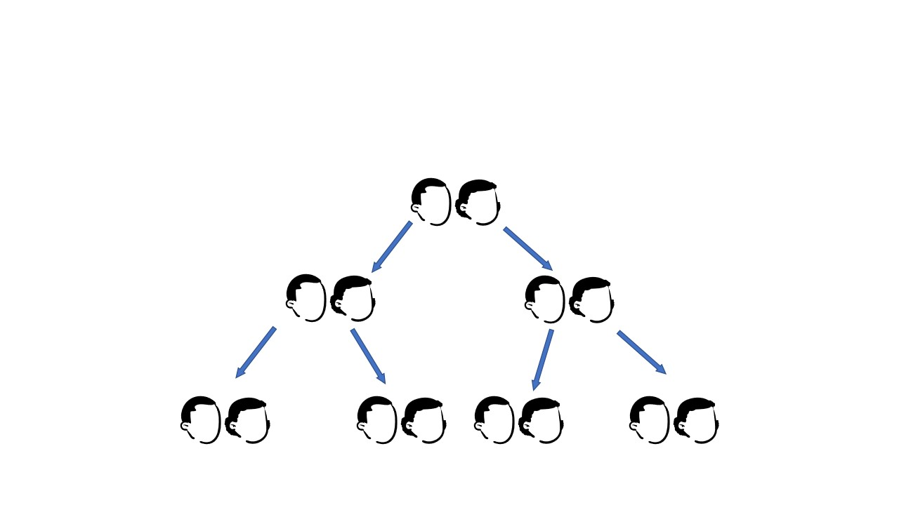
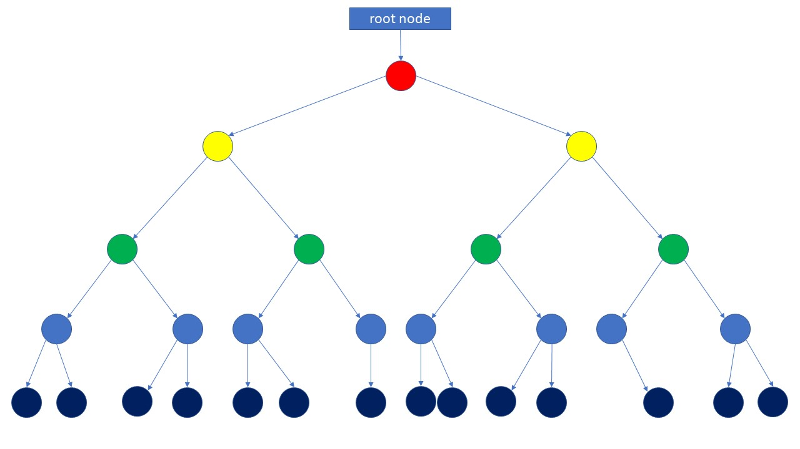
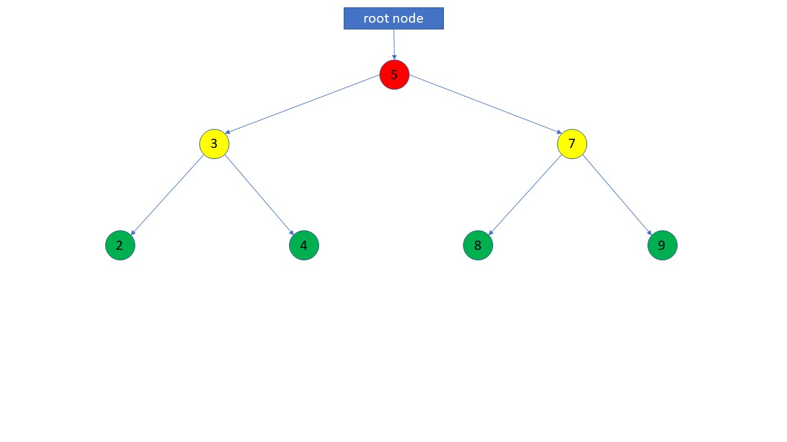
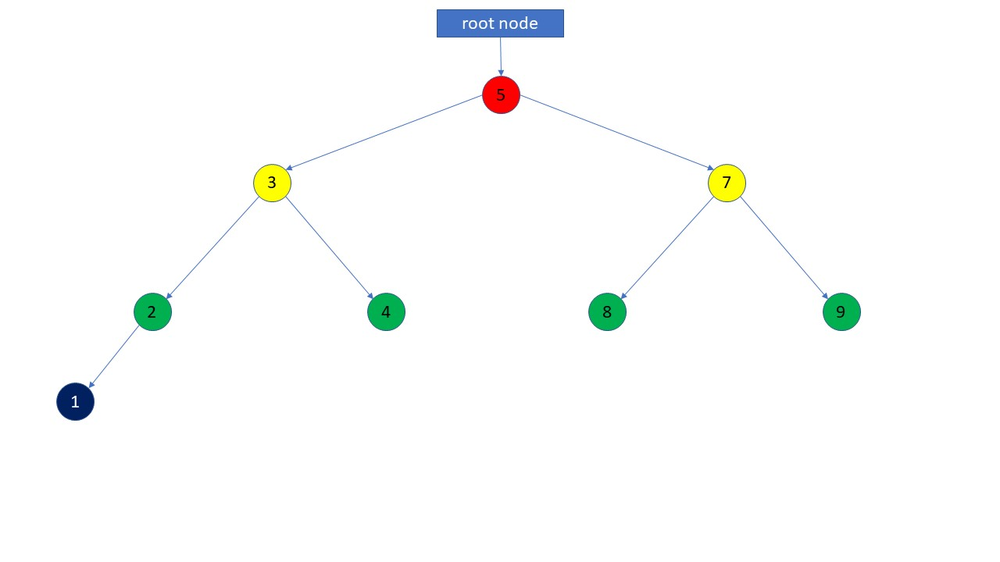
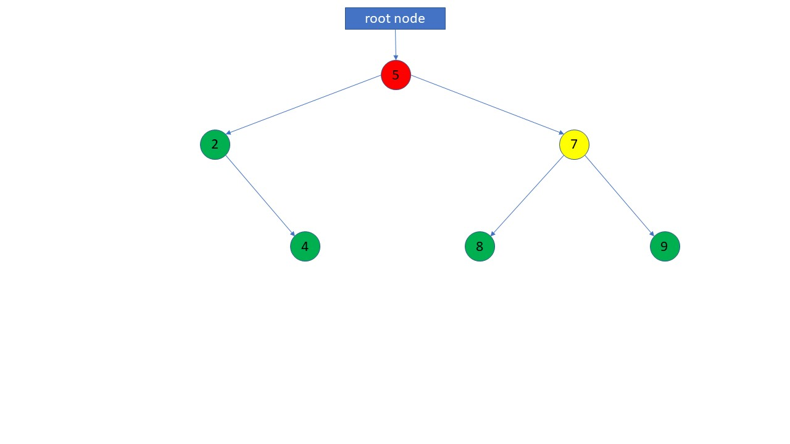
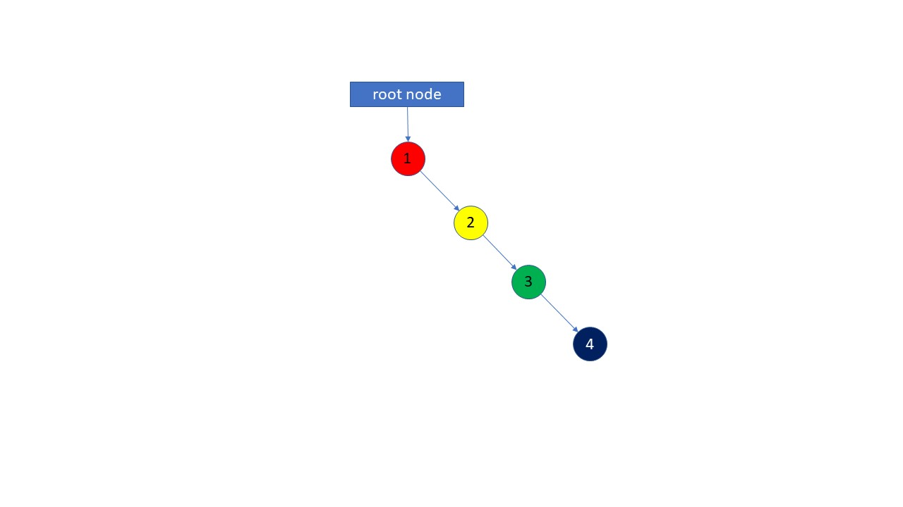
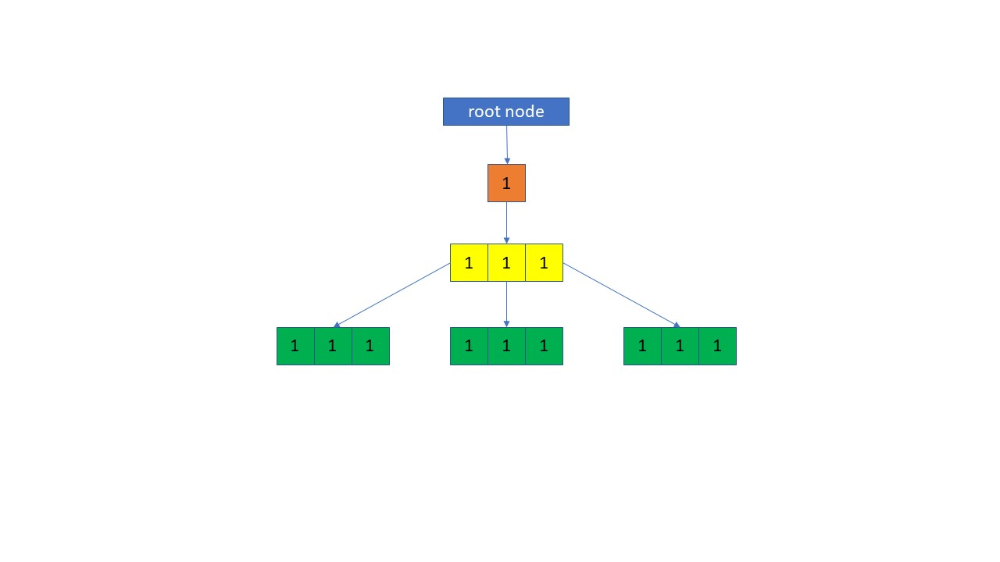

# Tree

> “Computers are good at following instructions, but not at reading your mind.”
> ― Donald Knuth[^1]

## Usage

Lets take a moment imagine a family tree. At the top of our tree are the primary ancestor. All the generations below them are their descendants. Directly below them are their children. The children are siblings, meaning that they share the same parents. This pattern can continue indefinitely.



Trees, in computer science, are a data structure made up of nodes connected in a hierarchical tree like fashion.[^2] There is a single "root" node. Each node may have 0 or more "child" nodes. Binary Search Trees (BST) are a specialized type of tree that allows each node to have 0 to two "child" nodes.


Here is how a simple BST would look.


Here is how an insertion would work. We compare each node to the insertion value starting from left to right, recursing down the tree until we reach a leaf.


Here is how an deletion would work. Again we recurse through the tree from right to left until we reach the node to delete. If the node has children then we need to rotate the nodes so that they are balanced and reconnect the subtree.


Self balancing BST's[^5] such as a red-black tree or AVL tree rotate nodes on insertion and deletion to maintain the balance of the tree. Otherwise we would just end up with a linked list.


Trees are commonly used data structures for when we have hierarchical data. They are also good at insertion and searching for data.[^3] As you can imagine this can be useful several types of application.

- File Systems
- Document Object Model in Web Browsers
- Hierarchy of classes in Object Oriented Programming.

## Time Complexity of Binary Search Tree[^4]

|     Operation      | Description                                | Time Complexity |
| :----------------: | :----------------------------------------- | :-------------: |
|   insert(value)    | Insert a value into a tree                 |    O(log n)     |
|   remove(value)    | Remove a value from the tree               |    O(log n)     |
|  contains(value)   | Determine if a value is in the tree        |    O(log n)     |
| traverse_forward() | Visit all objects from smallest to largest |      O(n)       |
| traverse_reverse() | Visit all objects from largest to smallest |      O(n)       |
|    height(node)    | Determine if the height of a node          |      O(n)       |
|       size()       | Return the size of the BST                 |      O(1)       |
|      empty()       | Returns true if the root node is empty     |      O(1)       |

## Example

Here is an example of a binary search tree.

```python
class BST:
    def __init__(self) -> None:
        """Initializes a new Binary Search Tree."""
        self._size = 0
        self.root = None

    @property
    def size(self):
        """A getter to return the size of the BST."""
        return self._size

    @property
    def empty(self):
        """A getter to check if the BST is empty."""
        return self._size == 0

    class Node:
        def __init__(self, data) -> None:
            """Initializes a new Node."""
            self.data = data
            self.left = None
            self.right = None

        def __str__(self) -> str:
            return self.data

    def insert(self, data):
        """Inserts data into the BST."""
        if self.root is None:
            self.root = BST.Node(data)
        else:
            self._insert(data, self.root)

    def _insert(self, data, node):
        """Look for location to insert data."""
        if data < node.data:
            if node.left is None:
                self._size += 1
                node.left = BST.Node(data)
            else:
                self._insert(data, node.left)
        elif data > node.data:
            if node.right is None:
                self.size += 1
                node.right = BST.Node(data)
            else:
                self._insert(data, node.right)
        else:
            return

    def __contains__(self, data):
        """Checks if BST contains data."""
        return self._contains(data, self.root)


    def _contains(self, data, node):
        """Searches BST for data."""
        if data < node.data:
            if node.left == None:
                return False
            else:
                return self._contains(data, node.left)
        elif data > node.data:
            if node.right == None:
                return False
            else:
                return self._contains(data, node.right)
        else:
            return True

    def __iter__(self):
        """Iterate through linked list."""
        yield from self._traverse_forward(self.root)

    def __reversed__(self):
        """Iterates backwards through linked list."""
        yield from self._traverse_backward(self.root)

    def _traverse_forward(self, node):
        """Steps left to right through the BST."""
        if node is not None:
            yield from self._traverse_forward(node.left)
            yield node.data
            yield from self._traverse_forward(node.right)

    def _traverse_backward(self, node):
        """Steps right to left throught the BST."""
        if node is not None:
            yield from self._traverse_backward(node.right)
            yield node.data
            yield from self._traverse_backward(node.left)
```

## Practice Problem

For our practice problem, we will use a generic tree[^6] that uses arrays to store its child nodes.
This will increase the time complexity of insertion and removal to O(n).


```python
class Node:
    def __init__(self, data, id=""):
        """Creates an instance of a node."""
        self.data = data
        self.parent = None
        self.children = []
        self.id = id

    def append_child(self, node: "Node"):
        """Adds a child node."""
        node.parent = self
        self.children.append(node)

    @property
    def height(self) -> int:
        """Get the height of the node."""
        node = self
        level = 0
        while node.parent != None:
            level += 1
            node = node.parent
        return level

    def __str__(self) -> str:
        """Creates a string representation of a Node."""
        str_val = ""
        str_val += f"\nTag:        {self.data}"
        str_val += f"\nParent:     {self.parent.data}"
        str_val += f"\nChildren:   {', '.join(child.data for child in self.children)}"
        str_val += f"\nId:         {self.id}"

        return str_val

class DocumentTree(Node):
    def __init__(self):
        """Creates a document tree whose root node is DOCUMENT."""
        # Constructor for super class.
        super().__init__(self)

        # Set the data of the root node to be
        self.data = "DOCUMENT"

    def create_element(self, data, id=""):
        """Create a new node."""
        return Node(data, id)

    def get_element_by_id(self, id):
        """
        Gets first node with id.
        Performance: O(n).
        """
        return self._get_element_by_id(id, self)

    def _get_element_by_id(self, id, node: Node):
        """Searches for selector name."""

        # If the selector is present in the node's selectors
        # Then return the current node.
        if id == node.id:
            return node

        # Base Case: We have reached a leaf.
        if len(node.children) < 1:
            return None

        # Continue searching tree.
        else:
            for child in node.children:
                result = self._get_element_by_id(id, child)

                # Return result if we found a matching node.
                if result is not None:
                    return result

        # We did not find a matching node.
        return None


    #################################
    #                               #
    #          PROBLEM #1           #
    #                               #
    #################################
    def remove_element_by_id(self, id):
        """Removes first element with id."""

        return self._remove_element_by_id(id, self)

    def _remove_element_by_id(self, id, node: Node, i=0):
        """Removes an element and all child nodes by id."""

        # NOTE: Add your code below.

    #################################
    #                               #
    #      END OF PROBLEM #1        #
    #                               #
    #################################


    def __str__(self) -> str:
        """Print a string representation of Document Tree"""
        return self._str(self)

    def _str(self, node: Node, line=""):
        """Build string line by line"""
        # If we start with the parent node then we just need its data.
        if node.parent == None:
            line = node.data

        # Create a new, indented line for each node.
        else:
            indent = " " * node.height * 4 + "|__"
            line = "\n" + indent + node.data

        # Base Case: We have reached a leaf.
        if len(node.children) < 1:
            return line

        # Create a new line for each child node.
        for child in node.children:
           line += self._str(child)

        # Return the final string from each subtree.
        return line


# Create new instance of document tree.
document = DocumentTree()

document.id = "#document"

# Create html element.
html = document.create_element("HTML")

# Create head element.
head = document.create_element("HEAD")

# Create a head element.
title = document.create_element("TITLE")

# Create body element.
body = document.create_element("BODY")

# Create main element.
main = document.create_element("MAIN", "#main")

# Create header element.
header = document.create_element("HEADER")

# Create a section element.
section = document.create_element("SECTION")

# Create a footer element.
footer = document.create_element("FOOTER")

# Append children.
document.append_child(html)
html.append_child(head)
html.append_child(body)
head.append_child(title)
body.append_child(main)
main.append_child(header)
main.append_child(section)
main.append_child(footer)

print(document)
"""
Output should look like the following:

DOCUMENT
    |__HTML
        |__HEAD
            |__TITLE
        |__BODY
            |__MAIN
                |__HEADER
                |__SECTION
                |__FOOTER
"""

print(document.remove_element_by_id("#main"))
print(document)
"""
Output should look like the following:

DOCUMENT
    |__HTML
        |__HEAD
            |__TITLE
        |__BODY
"""
```

You can find the solution [here](solution.py).

### Footnotes

[^1]: Quote by Donald Knuth, [AZ Quotes](https://www.azquotes.com/quote/562000)
[^2]: Tree Data Structure, [Wikipedia](<https://en.wikipedia.org/wiki/Tree_(data_structure)>)
[^3]: Introduction To Binary Trees, [Study Tonight](https://www.studytonight.com/data-structures/introduction-to-binary-trees)
[^4]: Trees, [BYU-I CSE 212 Course Notes](https://byui-cse.github.io/cse212-course/lesson09/09-prepare.html)
[^5]: Self-balancing binary search tree, [Wikipedia](https://en.wikipedia.org/wiki/Self-balancing_binary_search_tree)
[^6]: m-ary tree, [Wikipedia](https://en.wikipedia.org/wiki/M-ary_tree)
